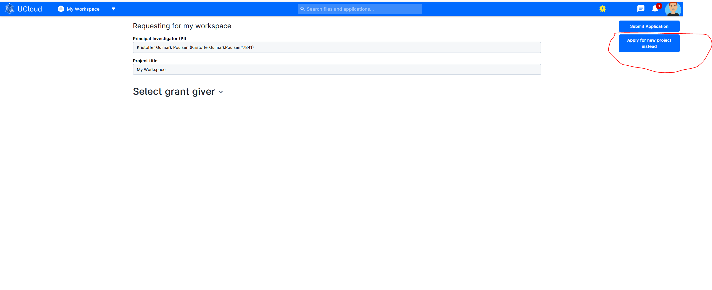
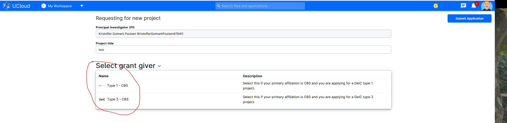
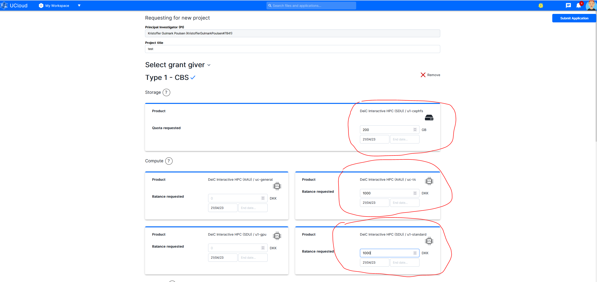
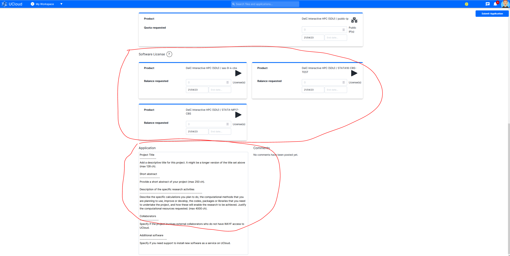

# Applying for UCloud in 5 Simple Steps

### Step 1: Select "Apply for resources" on the UCloud frontpage 

### Step 2: Select "Apply for new project instead"

### Step 3: Provide a Title and choice HPC type (1 or 3)

### Step 4: Choice Storage amount and Machine Type(in DKK). 

#### Only **"DeiC Interactive HPC (SDU) / u1-standard"(CPU) ** & **"DeiC Interactive HPC (AAU) / uc-t4" (GPU)** are relevant

