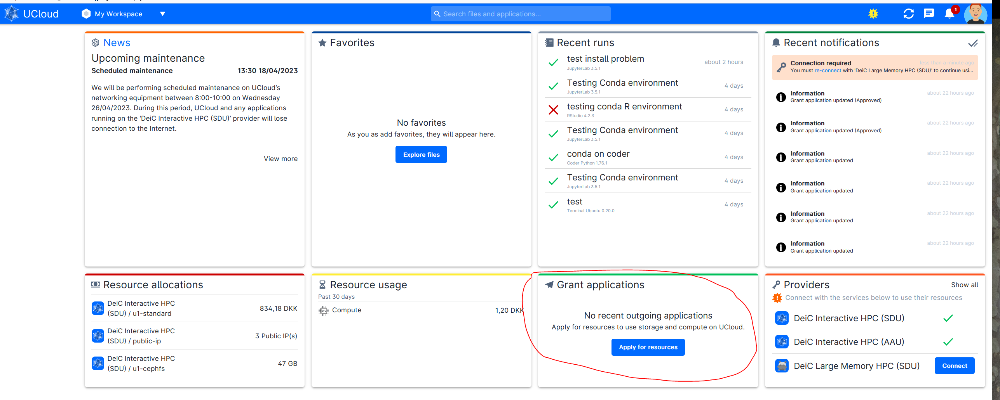
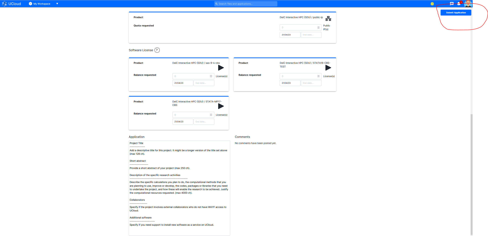

# Add License to Matlab, STATA and SAS application

If you have any further questions you are welcome to contact [RDM Support](rmd@cbs.dk).

## Add Local License 
### Step 1: Upload local STATA (.lic file) or SAS (.txt file) license to UCloud

### Step 2: Select the license file (.lic or .txt) while setting up UCloud Job

## Add Serer License

### Step 1: Apply for Server License through [UCloud Grant Application](https://github.com/CBS-HPC/.github/blob/main/profile/GrantApp.md)

### Step 2: Activate License

### Step 2: Select server license while setting up UCloud Job

