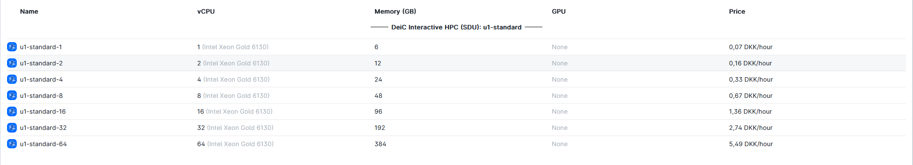
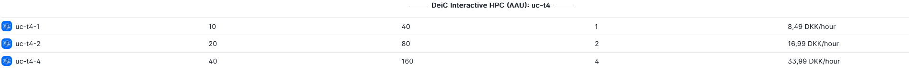

# Machine Type 

[SDU](https://cloud.sdu.dk/app/providers/detailed/ucloud) provides **CPU** based containerized applications such as MATLAB, STATA, RStudio, and JupyterLab through a graphical user interface (GUI), in the same way as you would on your laptop. [See all apps](https://docs.cloud.sdu.dk/Apps/type.html). 

When setting up a Job it is possible to select between the following machine types: 

[AAU](https://cloud.sdu.dk/app/providers/detailed/aau) provides primary **GPU** based [virtual machines](https://cloud.sdu.dk/app/applications/search?q=Virtual%20Machines). Access is obtained through terminal and [SSH](). It is possible to set up interactive enviroments such as [JupyterLab]().

